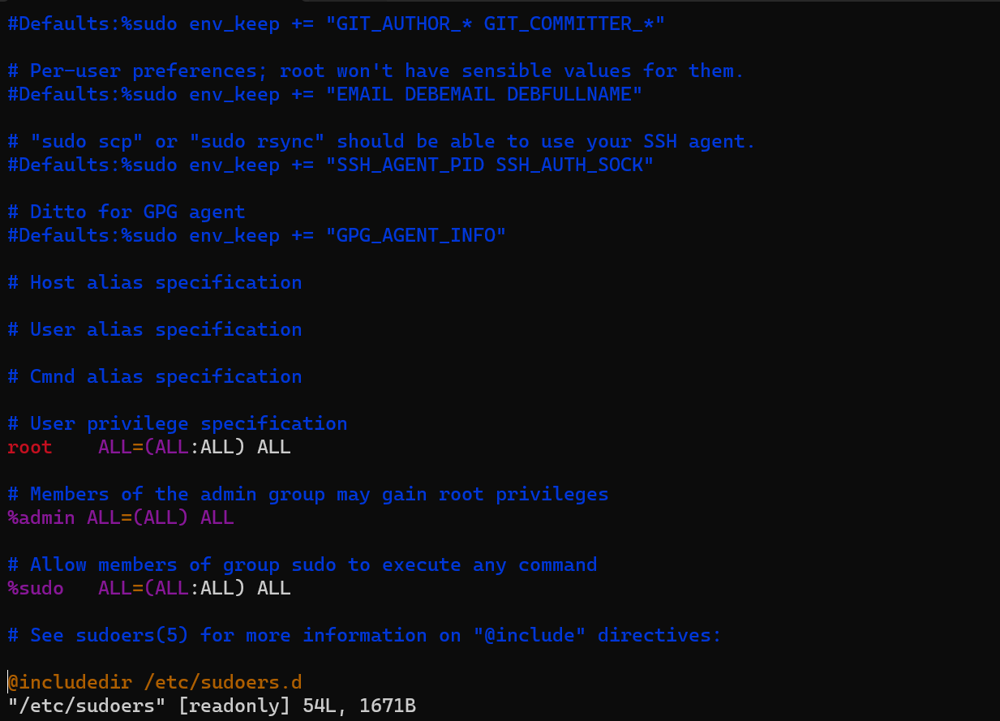

# User Authorization with sudoers

## What is sudo?

โดยปกติแล้วผู้ใช้ที่เป็น root ไม่จำเป็นต้องใช้คำสั่ง sudo แต่สำหรับผู้ใช้ธรรมดานั้นแล้ว sudo คือมีความจำเป็นในการทำหลายๆสิ่งมากที่ user ธรรมดาไม่มีสิทธ์เข้าถึง เช่น การติดตั้ง package หรือ การเพิ่ม user ในระบบ ล้วนแล้วแต่จำเป็นต้องใช้สิทธ์ root ในการเรียกใช้คำสั่ง เพราะ root มีสิทธ์ในระบบทุกอย่าง

ในการที่เราพิมพ์ sudo นำหน้าแล้วตามด้วยคำสั่ง คือการที่เราใช้สิทธ์ root เรียกคำสั่งนั้นขึ้นมา โดยผู้ใช้ sudo จะต้องกรอกรหัสผ่านของตัวเอง (Current User Password) ก่อนเพื่อยืนยันตัวตนถึงจะสามารถใช้คำสั่งที่เรียกได้

## The sudoers File

sudoers คือไฟล์ที่อยู่ใน */etc/sudoers* ทำหน้าที่ config คำสั่ง sudo ว่าใครสามารถใช้คำสั่ง sudo ได้บ้าง

***สำคัญ***
การแก้ไขไฟล์ sudo ต้องระวังอย่าให้มีข้อผิดพลาด หรือ syntax ที่ไม่ถูกต้องในไฟล์ไม่งั้นผู้ใช้ทั้งหมดอาจถูกล็อคออกไปจากระบบ

## sudoers File Syntax

## References

Ubuntu Official Document - https://help.ubuntu.com/community/Sudoers
 TechTarget Security - https://www.techtarget.com/searchsecurity/definition/sudo-superuser-do#:~:text=To%20use%20sudo%20to%20run,edit%20a%20system's%20host%20file.
 Hostinger Tutorials - https://www.hostinger.com/tutorials/sudo-and-the-sudoers-file/

